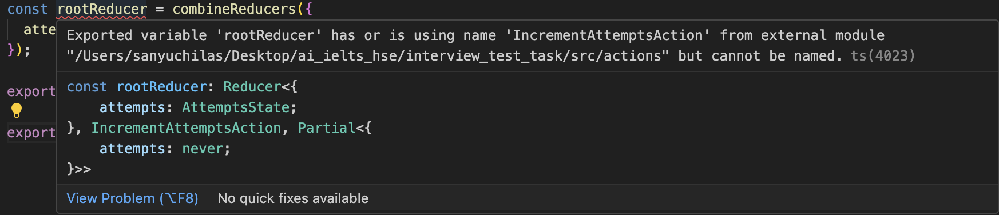

# 1 Контекст

Ты находишься в реальном магазине, в котором можно покупать попытки. Процесс попкупки попытки представляет собой нажатие на кнопку "Купить попытку", которую можно увидеть из любого места магазина. Но владелец магазина обнаружил большую неприятность - количество купленных попыток на счетчике отображатся неправильно.

Ты - опытный мастер, работающий в этом магазине, поэтому любую свою работу проводишь в отдельной ветке, навзание которой отражает выполняемую работу. После завершения работы ты создаешь Pull Request, чтобы такой же опытный мастер смог проверить твою работу.

# 2 Что надо сделать

## 2.1 Фикс бага

Нужно убедиться в том, что счетчик работает неправильно, и починить его.

## 2.2 Повышение качества обслуживания

Иногда случается такое, что клиент случайно задевает кнопку "Купить попытку", из-за чего незапланированно тратит свои финансы. Твоя задача состоит в том, чтобы найти решение этой проблемы. Предлагается сделать диалоговое окно, в котором клиенту будет необходимо дополнительно подтвердить покупу, либо же прекратить процесс покупки, если он случайно нажал кнопку "Купить попытку".

Любое другое решение данной проблемы тоже допускается.

## 2.3 Ошибка типизации

С большой вероятностью в исходном коде должна возникать следующая ошибка в типизации:

Нужно исправить эту ошибку.

# 3 Вопросы

1. Почему возникала ошибка типизации?
2. Почему в магазине не работал счетчик?
